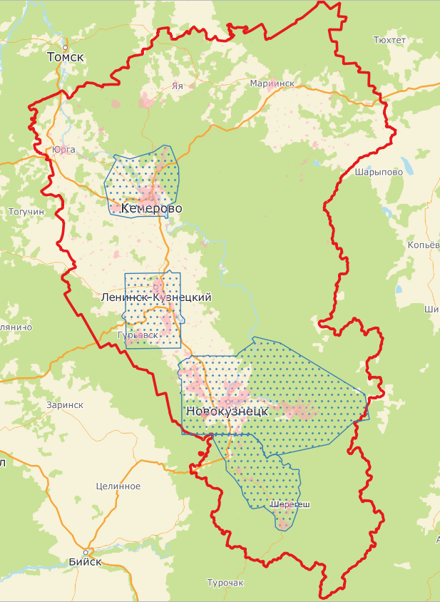

# Единицы территориального деления

Раздел описывает основные единицы территориального деления, которые используются в адресном плане и связаны с объектами карты и справочника.

## Основные понятия

| Термин | Описание |
|---|---|
| Территориальное деление | Разделение территории государства на части — единицы территориального деления, в соответствии с которым строится система местных органов власти. |
| Проект | Внутренняя единица территориального деления с актуальными и корректными объектами карты и справочника. Проекты постоянно «расширяют» свои границы, а также появляются новые проекты. Объекты, находящиеся за пределами Проектов, также могут быть использованы для работы, но нужно учитывать, что они могут быть неточными. |
| Область | Первый и самый крупный уровень административного деления страны. |
| Район | Второй уровень административного деления страны, единица деления областей. |
| Сельское / городское поселение | Муниципальное деление, представляющее собой один или несколько объединённых общей территорией сельских населённых пунктов или посёлков городского типа. Сельское поселение входит в состав муниципального района. Например: Антоновское СП, Октябрьский р-н Волгоградской области. |
| Административный округ | Муниципальное деление, обозначающее официально учреждённые администрацией города округа. Как правило, административный округ включает в себя несколько районов или поселений города. |
| Населённые пункты | Объекты, официально имеющие статус «населённый пункт». |
| Административный район (район города) | муниципальное деление, обозначающее городские районы, входящие в состав главного города проекта или городов-спутников. |
| Жилмассивы | Неофициальные административные единицы, не регистрируемые на законодательном уровне. Поэтому к ним предъявляются менее жёсткие требования. |

## Иерархия территориального деления

В общем виде территориальное деление может быть представлено следующей структурой:

<ul class="territory-tree">
  <li>
    Проект
    <ul>
      <li>
        Область / Субъект Федерации
        <ul>
          <li>
            Район области
            <ul>
              <li>
                Сельское / городское поселение
                <ul>
                  <li>
                    Населённый пункт
                    <ul>
                      <li>
                        Район города
                      </li>
                    </ul>
                  </li>
                </ul>
              </li>
            </ul>
          </li>
        </ul>
      </li>
    </ul>
  </li>
</ul>

> **⚠ Важно**
>
> Границы города не равны границам проекта.  
> Проект может включать территорию за пределами города  
> или даже за пределами субъекта РФ.

### Границы субъекта, проектов и населённых пунктов

**Обозначения на карте:**

- Красный контур — граница субъекта  
- Голубой контур — границы проектов  
- Розовые полигоны — границы населённых пунктов  

**Проект**  
Внутренняя единица 2ГИС. Границы проекта могут отличаться от официальных административных границ.

**Точность за пределами проекта**  
Объекты за пределами проектов могут быть представлены менее детально или менее точно.

**Административные округа**  
Используются только там, где они официально учреждены.

