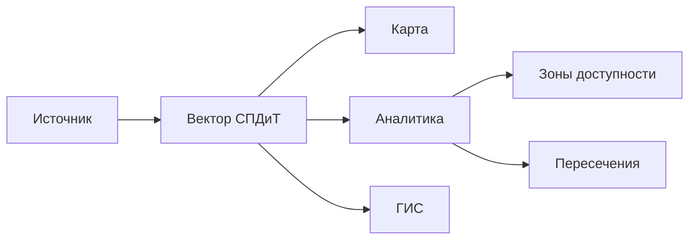

# :material-vector-polyline: Вектор. Обзор

!!! abstract "Кратко"
    **Вектор СПДиТ** — пространственные данные (точки, линии, полигоны),
    описывающие объекты территории, инфраструктуру, границы и зоны.

    :material-shape-outline: **6 типов геометрии** ·
    :material-map-search: **Анализ и витрины** ·
    :material-connection: **QGIS / ArcGIS / PostGIS**

---
## Структура слоёв векторных карт

Полное описание состава слоёв, используемых в векторных картах.

<a href="https://spdit-products-blocks-8961d6.gitlab-pages.2gis.io/" target="_blank" rel="noopener noreferrer">
  Структура слоёв векторных карт
</a>

## :material-target: Назначение

=== "Картография"

    - Отображение объектов на карте
    - Построение тематических слоёв
    - Формирование картографических витрин

=== "Анализ"

    - Пространственный анализ
    - Расчёт зон доступности
    - Проверка пересечений и попаданий

=== "Интеграция"

    - Использование в QGIS, ArcGIS, PostGIS
    - Формирование аналитических витрин
    - Обмен через GeoJSON / WKT

---

## :material-shape: Типы геометрии

| Тип | | Описание | Пример | Где применяется |
|---|---|---|---|---|
| `Point` | :material-map-marker: | Точка | Адресный объект | Картографирование, POI |
| `LineString` | :material-vector-line: | Линия | Дорога, коммуникация | Сетевой анализ |
| `Polygon` | :material-vector-square: | Полигон | Здание, зона | Пересечения, площади |
| `MultiPoint` | :material-map-marker-multiple: | Группа точек | Кластер объектов | Геоаналитика |
| `MultiLineString` | :material-vector-polyline: | Набор линий | Дорожная сеть | Маршрутизация |
| `MultiPolygon` | :material-vector-polygon: | Набор полигонов | Регион, район | Тематические слои |

---

## :material-sitemap: Жизненный цикл данных



---

## :material-code-json: Примеры данных

=== "GeoJSON · Point"
    ```json
    {
      "type": "Feature",
      "geometry": {
        "type": "Point",
        "coordinates": [37.61, 55.75]
      },
      "properties": { "name": "Вход в здание" }
    }
    ```

=== "GeoJSON · Polygon"
    ```json
    {
      "type": "Feature",
      "geometry": {
        "type": "Polygon",
        "coordinates": [[
          [37.60, 55.74],
          [37.62, 55.74],
          [37.62, 55.76],
          [37.60, 55.76],
          [37.60, 55.74]
        ]]
      },
      "properties": { "name": "Жилой дом" }
    }
    ```

=== "Shape · Point"
    ```text
    infrastructure_point.zip
    ├─ infrastructure_point.shp
    ├─ infrastructure_point.shx
    ├─ infrastructure_point.dbf
    └─ infrastructure_point.prj
    ```

    ```wkt
    POINT (37.61 55.75)
    ```

    | name |
    |---|
    | Объект инфраструктуры |

=== "Shape · Polygon"
    ```text
    territory_polygon.zip
    ├─ territory_polygon.shp
    ├─ territory_polygon.shx
    ├─ territory_polygon.dbf
    └─ territory_polygon.prj
    ```

    ```wkt
    POLYGON ((
      37.60 55.74,
      37.62 55.74,
      37.62 55.76,
      37.60 55.76,
      37.60 55.74
    ))
    ```

    | name |
    |---|
    | Территория |

=== "WKT"

    ```sql
    POINT(37.61 55.75)
    LINESTRING(37.60 55.74, 37.62 55.76)
    POLYGON((37.60 55.74, 37.62 55.74, 37.62 55.76, 37.60 55.76, 37.60 55.74))
    ```

---

## :material-lightbulb-on: Сценарии использования

??? tip "Картографирование"
    Отображение объектов и тематических слоёв на интерактивных картах.

??? tip "Пространственный анализ"
    Расчёт пересечений, расстояний, попаданий объектов в зоны.

??? tip "Зоны доступности"
    Построение буферов и зон обслуживания вокруг объектов.

??? tip "Геоаналитика"
    Анализ распределения объектов и плотности по территории.

??? tip "Интеграция с ГИС"
    Подключение слоёв в QGIS, ArcGIS, PostGIS через стандартные форматы.
