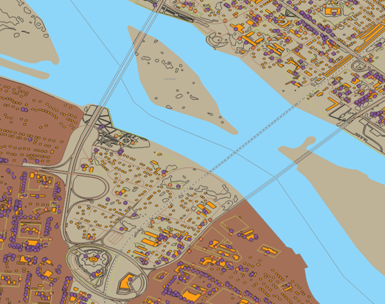
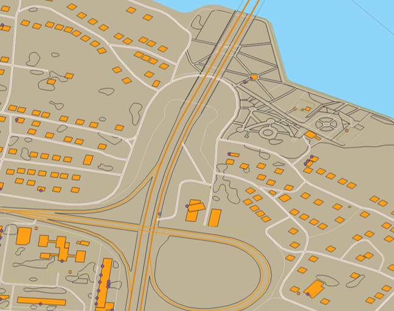
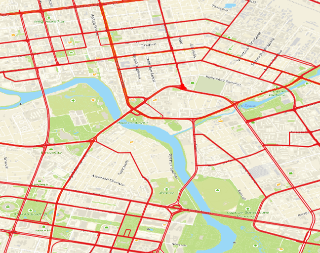
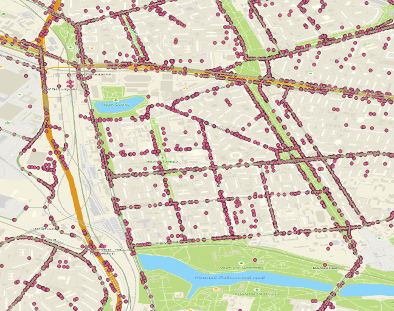
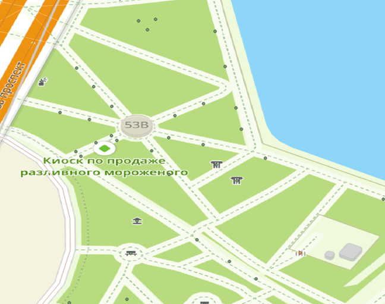
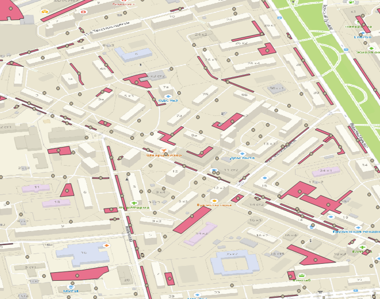
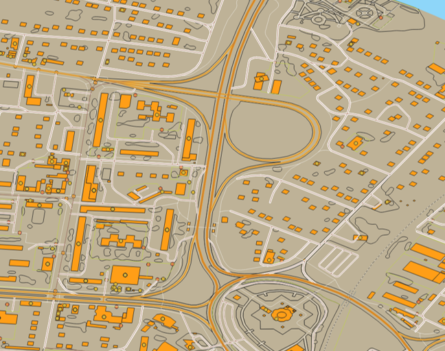
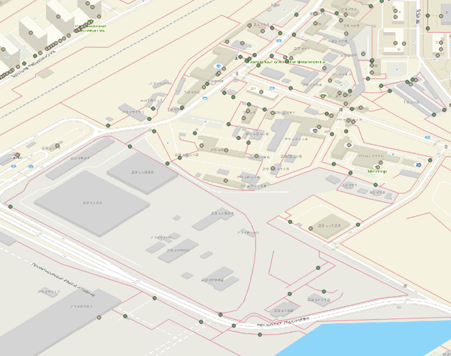

# Сценарии использования векторных карт

Векторные карты применяются для отображения объектов на карте, пространственного анализа, построения маршрутов, оценки городской инфраструктуры и интеграции с ГИС-системами.

[:material-arrow-left: Вернуться к модели данных](data-model.md){ .md-button }

---

## Галерея сценариев

-   **🗺 Векторные данные**

    ---

    

    Базовая картографическая основа: улицы, здания, кварталы, реки, мосты и жилмассивы.

    **Слои:** `House`, `Street`, `Quarter`, `City`, `District`

-   **🛣 Дорожный граф**

    ---

    

    Построение автомобильных маршрутов с учётом дорожной структуры и ограничений движения.

    **Слои:** `RoadGraph`, `RoadCrosses`, `RoadSignSet`, `Gateway`

-   **🚌 Транспортный граф**

    ---

    

    Анализ общественного транспорта, маршрутов, остановок и транспортной доступности.

    **Слои:** `TransportEdge`, `TransportStops`, `RailwayStops`

-   **🚏 Остановочные пункты**

    ---

    

    Анализ маршрутов, порядка прохождения остановок и загруженности остановочных пунктов.

    **Слои:** `TransportStops`, `TransportEdge`

-   **📍 Достопримечательности и места**

    ---

    

    Ориентиры, туристические маршруты, городские справочники и анализ общественных пространств.

    **Слои:** `Sights`, `Place`

-   **🅿️ Парковки**

    ---

    

    Учёт и планирование парковочной сети, анализ доступности и вместимости парковок.

    **Слои:** `ParkingsGround`, `ParkingsMultilevel`, `ParkingsUnderground`

-   **🏢 Организации с координатами**

    ---

    

    Отображение организаций и объектов на карте вместе с атрибутивной информацией.

    **Слои:** `Firms`, `House`, `HouseEnter`

-   **🚧 Заборы и ограничения прохода**

    ---

    

    Анализ физической доступности территории, проектные работы, доставка и эксплуатация.

    **Слои:** `Fence`, `Gateway`

---

## Матрица сценариев

| Сценарий | Что решает | Рекомендуемые слои |
|---|---|---|
| Базовая картография | Отображение территории и объектов карты | `City`, `District`, `Division`, `House`, `Street`, `Quarter` |
| Маршрутизация автотранспорта | Построение маршрутов с учётом дорожной сети | `RoadGraph`, `RoadCrosses`, `RoadSignSet`, `Gateway` |
| Анализ общественного транспорта | Анализ маршрутов, остановок и доступности | `TransportEdge`, `TransportStops`, `RailwayStops` |
| Туризм и городская среда | Отображение объектов интереса | `Sights`, `Place`, `Quarter`, `Street` |
| Парковочная инфраструктура | Учёт и анализ парковок | `ParkingsGround`, `ParkingsMultilevel`, `ParkingsUnderground`, `ParkingTerritory` |
| Организации на карте | Отображение организаций с координатами | `Firms`, `House`, `HouseEnter` |
| Инженерные и проектные работы | Анализ физических ограничений территории | `Fence`, `Gateway`, `House`, `Quarter` |
| Административный анализ | Работа с границами и территориальными единицами | `City`, `District`, `Division`, `LivingArea` |
| Гидрография | Отображение рек и направлений течения | `RiverLine`, `RiverPolygon`, `RiverDirect`, `NameRiver` |

---

## Подробное описание

??? tip "🗺 Векторные данные"

    Базовый сценарий использования векторных карт — отображение территории и объектов карты.

    **Используется для:**

    - построения картографической основы;
    - отображения объектов в ГИС;
    - пространственного анализа;
    - подготовки аналитических витрин;
    - интеграции с внутренними системами.

??? tip "🛣 Дорожный граф"

    Дорожный граф позволяет строить маршруты для автомобильного транспорта с учётом дорожной структуры и правил движения.

    **Ключевые возможности:**

    - построение маршрутов;
    - учёт направления движения;
    - учёт разворотов;
    - учёт дорожных знаков;
    - анализ перекрёстков;
    - использование Z-уровней;
    - работа с проездами, воротами, шлагбаумами и КПП.

    | Слой | Назначение |
    |---|---|
    | `RoadGraph` | Основная дорожная сеть |
    | `RoadCrosses` | Перекрёстки |
    | `RoadSignSet` | Дорожные знаки |
    | `Gateway` | Проходы, проезды, ворота, шлагбаумы |

??? tip "🚌 Транспортный граф"

    Транспортный граф используется для анализа общественного транспорта и городской мобильности.

    **Может применяться для:**

    - анализа покрытия территории маршрутами;
    - оценки транспортной доступности;
    - визуализации маршрутов;
    - анализа пересадочных узлов;
    - планирования развития транспортной сети.

    | Слой | Назначение |
    |---|---|
    | `TransportEdge` | Звенья транспортной сети |
    | `TransportStops` | Остановки общественного транспорта |
    | `RailwayStops` | Остановки железнодорожного транспорта |

??? tip "🚏 Остановочные пункты"

    Остановочные пункты позволяют анализировать доступность общественного транспорта и прохождение маршрутов через конкретные точки.

    **Примеры задач:**

    - определить количество маршрутов через остановку;
    - оценить загруженность транспортного узла;
    - найти территории без остановок в пешей доступности;
    - построить зоны транспортной доступности.

??? tip "📍 Достопримечательности и места"

    Слои достопримечательностей и мест используются для отображения городских объектов, ориентиров и точек интереса.

    **Могут применяться для:**

    - туристических карт;
    - городских маршрутов;
    - справочников достопримечательностей;
    - анализа общественных пространств;
    - развития городской среды, туризма и спорта.

??? tip "🅿️ Парковки"

    Парковочные слои позволяют учитывать разные типы парковок и связанные с ними атрибуты.

    **Поддерживаемые типы парковок:**

    - наземные;
    - многоуровневые;
    - подземные;
    - территории парковок.

    | Слой | Назначение |
    |---|---|
    | `ParkingsGround` | Наземные парковки |
    | `ParkingsMultilevel` | Многоуровневые парковки |
    | `ParkingsUnderground` | Подземные парковки |
    | `ParkingTerritory` | Территории парковок |

??? tip "🏢 Организации и объекты с координатами"

    Организации и иные объекты, выгружаемые с координатами, могут отображаться на карте вместе с атрибутивной информацией.

    **Примеры использования:**

    - геомаркетинг;
    - анализ конкурентов;
    - поиск организаций в зданиях;
    - отображение организаций на карте;
    - анализ деловой активности территории;
    - подготовка тематических карт.

??? tip "🚧 Заборы и ограничения прохода"

    Слои заборов и проходов помогают учитывать физические ограничения территории.

    **Используется для:**

    - проектных работ;
    - планирования телекоммуникационных сетей;
    - служб доставки;
    - МВД и экстренных служб;
    - анализа доступности объектов;
    - оценки маршрутов прох